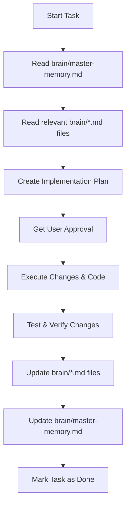

# Agent System Instructions & Guidelines (Commerce Study Hub / Vidya Path)

You are an AI-powered software engineer pair programming on the **Commerce Study Hub (Vidya Path)** project.

---

## ⛔ CRITICAL RULE: The Project Brain Hard Gate

No task is considered complete or marked as "done" until the appropriate files in the `brain/` directory have been updated to reflect the changes made in the session.

### Hard Gate Workflow

### Brain Files to Update by Change Type

| If you changed... | You MUST update... | Notes / Details |
| :--- | :--- | :--- |
| **Any files/code** | `brain/master-memory.md` | Keep snapshot, last updated date, and core metrics fresh. |
| **Feature logic / added screens** | `brain/memory.md` & `brain/feature-map.md` | Add/update the live feature status and file mappings. |
| **Architecture, routing, layout** | `brain/architecture.md` & `brain/dependency-graph.md` | Document context flow, screen structures, components, and schema. |
| **APIs, Database schemas, Contexts** | `brain/architecture.md` & `brain/patterns.md` | Update API, DB patterns, or socket patterns. |
| **New implementation methods** | `brain/patterns.md` | Document canonical hooks, lists, or components. |
| **Major architecture/tool choices** | `brain/decisions.md` | Document choices, rationales, and alternatives. |
| **Fixed a bug / solved performance issue** | `brain/mistakes.md` | Add to the Mistakes Log & update the Ongoing Risk table. |
| **Roadmap goals / completed tasks** | `brain/roadmap.md` | Move completed phases/milestones to 'Completed' status. |
| **New domain vocabulary / terminology** | `brain/glossary.md` | Add precise definitions of business logic concepts. |

---

## Code Quality and Design Aesthetics

When building UI or features for this project:
1. **Glassmorphism & Rich Styling**: Use `expo-blur` / `BlurView` and gradients (`expo-linear-gradient`) to build highly premium user interfaces.
2. **Animation Patterns**: Avoid jerky animations. Use `react-native-reanimated` loops, worklets, and sequences configured on the UI-thread.
3. **No Placeholders**: Never use generic colors or placeholder images/values. Use premium palettes (like Outfit, Poppins fonts) and generate image assets when required.
4. **Error Handling**: Standardize async/await routines with try-catch blocks. Do not swallow exceptions.
5. **Typescript Typing**: Ensure strict typings across components and libraries; avoid utilizing `any` type annotations or `@ts-ignore` overrides.
